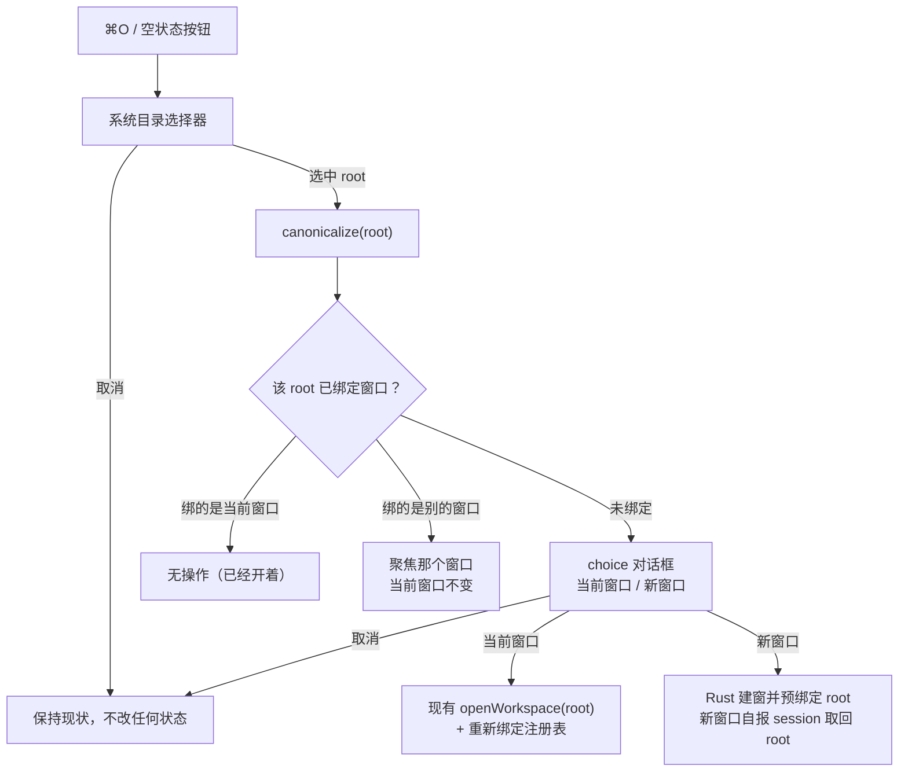
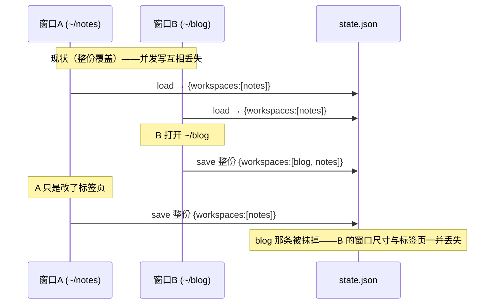

# 多工作区窗口 · 概要设计

状态：V1.0.2，已实现并经一轮独立评审，评审发现已修复。全部决定均已由用户拍板。

来源与详细设计：

- 需求裁决：本次会话的 clarify 结果（四条，见[背景与范围](#背景与范围)）
- 被本文修订的既有设计：[MDX双模式文档与工作区需求设计文档.md](../MDX双模式文档与工作区需求设计文档.md) 第 2.2 节「Workspace Mode 主窗口第一版唯一」及其决策边界「必须回 clarify：是否允许多个 Workspace Mode 主窗口」
- 详细设计：[需求设计文档.md](需求设计文档.md)

修订：

| 版本 | 修订内容 | 时间 |
|---|---|---|
| V1.0.0 | 新建。把 Workspace 窗口从单例改为多实例，并把 `state.json` 的写入归属从「前端整份覆盖」改为「Rust 分段合并」 | 2026-09-20 |
| V1.0.1 | D-006 由 proposed 转 accepted：失效根目录连同其标签页状态一并删除（用户裁决，非本文原推荐），提示条落在第一个恢复成功的窗口 | 2026-09-20 |
| V1.0.2 | 独立评审后修正 [D-005](#D-005)：退出守卫改用窗口计数，原 `ExitRequested` 标志经核对运行时源码证实永远为 false。同时记录三处实现期缺陷的处置（见[风险](#风险验证与待决事项)） | 2026-09-20 |

## 背景与范围

今天 ⌘O「打开文件夹」只能在当前窗口换工作区：`WindowSessionRegistry` 用一个 `Option<String>` 记住唯一的 workspace 窗口 label（`src-tauri/src/window_sessions.rs:34`），`claim_workspace_window()` 永远返回常量 `"workspace-main"`（同文件 :83），`new_workspace_window_with_route` 发现窗口已存在就只 `set_focus` 并返回（`src-tauri/src/lib.rs:526`）。用户想并排看两个笔记库时没有出路。

本次要做的是：选完目录后由用户决定开在哪里。四条已拍板的需求：

- **AC-1** ⌘O 选完目录后，弹应用内 choice 对话框让用户选「当前窗口 / 新窗口」。
- **AC-2** 重启应用时恢复上次打开的**全部**工作区窗口。
- **AC-3** 目标目录已在另一个窗口开着时，聚焦那个窗口，不新开。
- **AC-4** 窗口尺寸按工作区根目录各记一份。
- **AC-5**（受保护）Document 窗口、CLI、文件监听、菜单角色分发的现有行为不回归。

非目标（非显然的排除）：

- 不做跨窗口的偏好实时同步。窗口各自持有启动时读到的 `preferences`，改动只在下次启动或该窗口自己改时生效。分段写（[D-004](#D-004)）已经消除了「A 窗口改偏好被 B 窗口覆盖」这个真实缺陷；广播是另一个需求。
- 不做窗口位置（x/y）持久化。AC-4 只说尺寸，现有 `PersistedWindowSize` 也只有 width/height。
- 不做「窗口」菜单、窗口间拖拽标签页、同一目录开多个窗口。
- 不引入单实例约束。应用本来就没有 single-instance 插件，多进程同时写 `state.json` 仍是后写覆盖——这是既有行为，不在本次范围内，见[风险](#风险验证与待决事项)。

## 核心方案

### 窗口模型：从「唯一 label」到「根目录 → 窗口」的绑定

**D-001 · 架构契约 · accepted** — Workspace 窗口改为计数器发号的多实例，label 形如 `workspace-<n>`，常量 `WORKSPACE_WINDOW_LABEL` 换成 `WORKSPACE_WINDOW_LABEL_PREFIX`。

`capabilities/default.json` 的 `"w*"` 通配已经覆盖这个前缀，不需要改权限文件——但 `capabilities_tests.rs:47` 断言的是那个固定 label，必须改成断言 `workspace-0` / `workspace-17`，否则测试会挡住改动却不说明真实原因。

**D-002 · 状态契约 · accepted** — 注册表把每个 workspace 窗口绑定到一个 canonical 根目录，绑定可以晚于窗口创建。

必须允许「先有窗口后有根目录」，因为三条入口的时序不同：⌘O 选新窗口时根目录已知；启动恢复时已知；macOS 点 Dock 图标冷启动、且没有可恢复的根目录时，窗口先开出来、用户才在选择器里选。所以注册表存 `label -> Option<PathBuf>`，并提供一个「窗口报告自己打开了哪个根目录」的绑定命令；同一个窗口换工作区就是重新绑定。

去重（AC-3）按 `canonicalize` 后的路径比对，和 Document 窗口按 real path 去重的既有做法一致（`window_sessions.rs:89`），这样符号链接和大小写差异不会开出两个窗口。

**D-003 · 行为契约 · accepted** — 打开文件夹分三个出口，去重检查在对话框**之前**。

已经开着的目录不该再问「当前窗口还是新窗口」——两个答案都不对（新窗口违反 AC-3，当前窗口会造出同一目录的两个窗口）。所以顺序是：选目录 → canonical 化 → 查绑定 → 命中才不问。

图示为已实现的流程。Z1/Z2/Z3 是三个不改变工作区状态的出口；F/G 是两个真正打开的出口。

### `state.json` 的写入归属：前端整份覆盖 → Rust 分段合并

这是本次真正的设计点，也是多窗口唯一会**默默损坏用户数据**的地方。

今天 `~/.loam/state.json` 由前端整份写回：每个窗口在 bootstrap 时 `load_app_state` 拿到完整 `AppState` 存进 `appStateRef`，之后四个写入点（工作区防抖保存 `use-workspace-bootstrap.ts:250`、窗口尺寸 :286、`persistCurrentWindowSize` :385、`updatePreferences` :418）都把这份内存副本整个交给 `save_app_state`，Rust 原子覆盖整个文件（`state_store.rs:186`）。单窗口时这没问题。两个窗口并存时，各自的 `appStateRef` 都停留在自己启动那一刻，谁后写谁把对方的 `workspaces[]` 和 `windowSize` 抹掉：

**D-004 · 状态契约 · accepted** — Rust 成为 `state.json` 的唯一写者：前端只提交**自己那一段**，Rust 在进程级互斥下做读—改—写合并。

选这个而不是「前端做乐观重试」有两个理由。一是不变量本来就是分段的——`preferences` 全局一份、`workspaces[]` 按 `rootPath` 分片、`openWorkspaceRoots` 由窗口绑定关系派生——分段写让每个段有唯一写者，冲突消失而不是被检测。二是所有窗口在同一个进程里，一个 `Mutex` 就是充分的互斥，不需要版本号或 CAS。按 loopx 的共享并发合同（`shared/database-concurrency.md`），这属于「确立单写者所有权」，不引入锁重试。

段的归属：

| 段 | 写者 | 触发 |
|---|---|---|
| `preferences` | 改动偏好的那个窗口 | `updatePreferences` |
| `workspaces[<rootPath>]`（含该 root 的 `windowSize`） | 绑定该 root 的那个窗口 | 标签页/面板防抖保存、resize |
| `recentWorkspaceRoot` | 最近打开工作区的窗口 | 随 workspaces 段一起写 |
| `openWorkspaceRoots` | **Rust 注册表**，不由前端提交 | 绑定/重绑定/窗口销毁 |

**D-005 · 状态契约 · accepted** — `openWorkspaceRoots` 从注册表派生，且**退出应用时不清空**。

前端没法维护这个列表——每个窗口只知道自己，谁也不该替别人删条目。注册表知道全部绑定，让它在绑定变化时写这一段，天然无竞争。

这里有个必须设计掉的陷阱：退出时每个窗口都会走 `WindowEvent::Destroyed`（`lib.rs:1253`），如果照常从列表里摘掉自己，退出完成时列表就空了，下次启动什么也恢复不了。

**本设计的第一版用错了判据**，评审时纠正：原方案是在 `RunEvent::ExitRequested` 置一个「正在退出」标志。核对 `tauri-runtime-wry-2.10.1/src/lib.rs:4126-4185` 后发现顺序恰好相反——运行时先回调 `WindowEvent{Destroyed}`，之后才检查窗口表是否空掉来决定发不发 `ExitRequested`；macOS 从 Dock 退出更是走 `LoopDestroyed` → `RunEvent::Exit`，压根不发 `Destroyed`。所以那个标志在守卫里永远是 false，守卫是死的。

正确的判据是**窗口计数**：关掉多个中的一个，说明用户收窄了想要恢复的集合 → 重写列表；关掉最后一个，这就是这个应用的退出方式（运行时在窗口表空掉时 exit）→ 不动列表。崩溃退出同样安全——最后一次绑定变化时写下的列表仍然有效。

**D-006 · 行为契约 · accepted** — 启动恢复的顺序与失效根目录的处置。

1. 读 `openWorkspaceRoots`，按顺序为每个**仍存在且是目录**的根开一个窗口。
2. 不存在 / 不是目录 / 无权限 → 跳过该窗口，从 `openWorkspaceRoots` 摘掉，**并删除 `workspaces[]` 里那条标签页状态**。用户在 2026-09-20 的裁决中选了这一项而非保留：`state.json` 不随失效目录逐年积攒。接受的代价是外接盘或网络盘在启动时恰好未挂载，该工作区的标签页与面板状态就此丢失且不可恢复——本条是有意为之，不要在实现时"顺手"加保留逻辑。
3. 一个都没恢复成功（列表为空或全部失效）→ 回落到现有行为：`recentWorkspaceRoot` → 仍失效则开一个空窗口并弹目录选择器。
4. 跳过的目录不逐个弹窗打断启动；在第一个成功恢复的窗口里显示一条可关闭的提示条，列出被跳过的路径。一个都没恢复时，提示显示在空窗口的 empty state 上。
5. 不设恢复窗口数上限——用户自己开了几个就是几个，凭空加阈值会在没有证据的情况下改变验收。

### 其余受影响的共享状态

**D-007 · 状态契约 · accepted** — `DirtyWorkspacePaths` 按窗口 label 分桶，读时合并。

今天它是全局一份，`update()` 整体替换（`window_sessions.rs:58`），命令 `update_workspace_dirty_paths` 甚至不带窗口参数（`lib.rs:921`），而且任一 workspace 窗口销毁就 `clear()` 全部（`lib.rs:1274`）。Document 窗口靠它判断「工作区里这个文件有未保存改动」（`lib.rs:907` 的 `workspaceDirty`）。多窗口下这会**误报未保存状态**：B 窗口一次保存就抹掉 A 窗口的脏路径，Document 窗口于是认为文件是干净的。改成 `label -> 路径集合`，`contains` 对所有桶取并集，销毁只清该 label 那一桶。

**D-008 · 数据契约 · accepted** — 窗口尺寸下沉到 `workspaces[].windowSize`，顶层 `windowSize` 保留为兜底。

未绑定根目录的空窗口、以及某个 root 第一次打开时，都取顶层那份；resize 时若已绑定 root 就写进该 root 那条，未绑定则写顶层。

沿用前端现有的「bootstrap 后 `setSize`」路径（`use-workspace-bootstrap.ts:181`），只改它读哪一份尺寸。让 Rust 在建窗时就按 root 读出尺寸当 `inner_size` 能消掉那一次可见的尺寸跳变，但那是既有现象、不在本次需求内，留作后续。

**D-009 · 行为契约 · accepted** — Document 窗口按 ⌘O 时，目标是**最近聚焦过的** workspace 窗口；一个都没有才新建。

今天这条路径（`lib.rs:645` `focus_or_create_workspace_window_and_open_folder`）指向那个唯一窗口，多窗口后「哪一个」成了真问题。注册表记一个 `last_focused_workspace`，在 `WindowEvent::Focused(true)`（`lib.rs:1243` 已有这个分支）时更新。新建时仍走 `?workspaceAction=openFolder` 路由参数，前端 `workspace-app.tsx:384` 的既有处理不变。

**D-010 · 数据契约 · accepted** — `state.json` 用additive 字段迁移，不提升 `stateVersion`。

新增 `openWorkspaceRoots`、`workspaces[].windowSize` 都带 `#[serde(default)]`，旧文件照常加载；顶层 `windowSize` 保留，作为没有 per-root 尺寸时的种子。提升版本号会新增一条没有任何读者的迁移分支，`load_state_from_path` 今天也只把 `0` 补成默认值（`state_store.rs:197`），不按版本分流。

接受的代价：降级回旧版本后，旧二进制仍会整份覆盖写，新增字段会被静默丢掉。这只影响「恢复全部窗口」和 per-root 尺寸，不损坏标签页数据。

## 变更与影响

被本文修订的既有约定：[双模式设计文档](../MDX双模式文档与工作区需求设计文档.md) 第 2.2 节的「Workspace Mode 主窗口第一版唯一」，以及它列在决策边界里的「必须回 clarify：是否允许多个 Workspace Mode 主窗口」。该问题已由本次 clarify 裁决为「允许」，其 3.3/3.4/4.5/7.2 节中描述「唯一 workspace window」的条目随本文失效。该文档的 Document Mode 设计不受影响。

不需要改动的既有面（已查实为多窗口就绪）：

- `capabilities/default.json` 的 `"w*"` 通配已覆盖 `workspace-*`
- `cli_server` 的 `CliState.windows` 本就按 label 分桶，命令靠 `focused_or_first_window_label` 选窗口（`cli_server.rs:1150`）
- `file_watch` 注册带 `window_label`，销毁时按 label 清理（`file_watch.rs:140`）

受保护但需要复验的行为：菜单按窗口角色启停（`lib.rs:766`）、Document 窗口的 `workspaceDirty` 提示、CLI 在多窗口下选中聚焦窗口、关闭未保存标签页的拦截。

## 风险、验证与待决事项

| 风险 | 后果 | 处置 |
|---|---|---|
| 退出时清空 `openWorkspaceRoots` | AC-2 完全失效且用户察觉不到原因 | [D-005](#D-005) 的窗口计数判据。第一版用 `ExitRequested` 标志，评审证实其永远为 false；已改并由 `closing_the_last_workspace_window_leaves_the_restore_list_alone` 钉住 |
| 持锁时读到损坏的 `state.json` | 读路径的修复分支会再取一次同一把不可重入锁 → 该线程死锁，之后所有窗口的所有保存都排在它后面；窗口也关不掉 | 修复写改用不加锁的 `write_state_file`；由 `merging_into_a_corrupt_state_file_repairs_it_instead_of_deadlocking` 钉住 |
| 窗口构建失败被当成「目录不可用」 | 会触发 [D-006](#D-006) 的不可逆删除，删掉一个其实完好的工作区的标签页 | 恢复流程改为先探测全部根目录、再建窗；只有探测失败才进 `forget`，建窗失败仅记日志并保留该根目录 |
| 脏路径分桶漏改 | Document 窗口误报「无未保存改动」，用户可能丢数据 | [D-007](#D-007)；TC-5 覆盖 |
| 多进程同时运行 | 两个进程仍会整份互相覆盖 | 既有行为，非本次范围。应用无 single-instance 插件；如果将来要修，属于新的设计 |
| 跨窗口偏好不同步 | A 改的排除目录，B 要到下次启动才生效 | 已接受，列为非目标 |

验证要点见详细设计的 [Verification Strategy](需求设计文档.md#verification-strategy)。会被本次改动推翻的既有测试：`window_sessions_tests.rs:55` `registry_keeps_one_workspace_window`（语义反转）、`capabilities_tests.rs:47`（断言的 label）、`state_store_tests.rs` 中依赖整份 `save_app_state` 的用例。

待决：无。[D-006](#D-006) 已于 2026-09-20 定稿。

评审状态：已由独立评审者对照实际 diff 审查一轮（2026-09-20），2 个 Critical、5 个 Important 已修复并各自补了回归测试，其余小项见[风险](#风险验证与待决事项)与详细设计。
