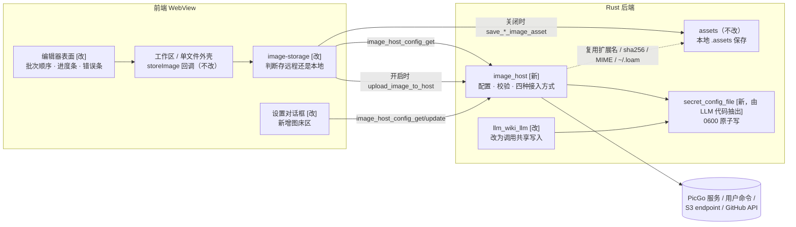
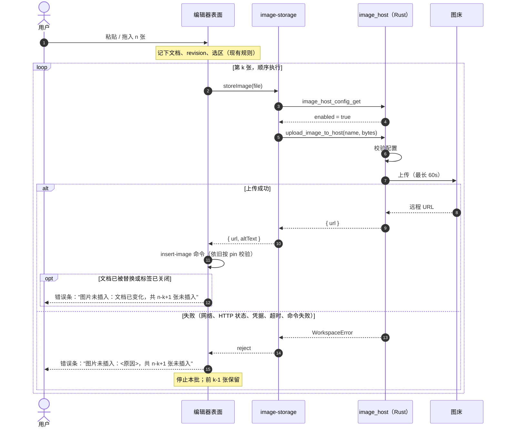

# 图床上传 · 概要设计

状态：Accepted（用户 2026-09-28 确认），实现中。
来源：[需求](../../../../.loopx/intake/2026-09-28-image-host-upload/requirements.md)（本地 intake，不入库，下文以 AC-*、R-* 引用）
详细设计：[需求设计文档.md](需求设计文档.md)
修订：2026-09-28 初稿；同日用户确认。实现后的独立审查发现，上传期间关闭标签会让失败提示丢失，所以 D-004 改为由外壳显示失败条（表面仍负责组织文案）；并补充了"WebView 可以配置并触发 shell 命令"这一已知风险。详细设计中的其他修订见[需求设计文档](需求设计文档.md)。

## 背景与范围

现在粘贴或拖入的图片一律写到本地：工作区窗口写到根目录的 `.assets`，单文件窗口写到同级 `.assets`，都失败时写到 `~/.loam/assets`。本次加入一个全局可选的图床（R-4），默认关闭。开启后图片上传到用户配置的图床，文档里只写远程 URL。第一版支持四种接入方式，同一时间只有一种生效（R-1、R-6）：PicGo/PicList 本地服务、自定义命令、S3 兼容存储、GitHub 仓库。

有两点容易误解：

- 图床开启后上传失败，也**不会**改存到本地（R-2）。原因是用户可能以为文档里全是远程链接，发布后才发现有图片坏了。
- 已有文档中的本地图片不迁移，CLI/Agent 的插图路径不变，删除文档中的图片也不删除远程文件。

开启图床意味着图片会离开本机，这和产品"本地优先"的定位相反。所以图床必须由用户主动开启，设置页也要写明这一点。

## 核心方案

### 模块与依赖

图 1：各模块的职责和依赖（Accepted）。实线表示调用，**[新]** 表示新增，**[改]** 表示修改。

**D-001 · Behavior Contract · Accepted**：由 `image-storage` 的 `storeImageForWorkspace` / `storeImageForDocument` 决定图片存到哪里。每次存图前先读一次图床配置：开启就上传，关闭就调用和现在完全一样的本地保存命令。两个外壳传入的 `storeImage` 回调和编辑器表面的存储契约都不改，所以工作区窗口和单文件窗口会同时生效，拖入和粘贴也天然一致（AC-3、AC-4）。配置每次都由 Rust 从文件中现读，前端不缓存。这样在一个窗口修改设置后，其他窗口下一次粘贴就会用新配置。代价是图床关闭时每次粘贴会多一次读取小文件的 IPC。图片字节只发送一次，因为先查配置、后发字节。
来源：AC-1 ~ AC-4。

**D-002 · Architecture Contract · Accepted**：上传全部由新的 Rust 模块 `image_host` 完成，前端从不直接访问网络。这样做有三个原因：凭据留在 Rust 中，不需要回传给前端（AC-13）；PicGo 本地服务不保证带 CORS 头；自定义命令必须由后端启动进程。上传命令是 `async` 的，在 `spawn_blocking` 中执行阻塞的 `reqwest` 调用或进程调用，做法和 `llm_wiki::run_blocking` 相同。Tauri 的同步命令在主线程运行，如果在那里做网络上传会冻结界面。
来源：AC-9 ~ AC-13。

**D-003 · Data Contract · Accepted**：配置保存在 `~/.loam/image-host.json`，权限 0600，四种接入方式的字段全部保留，切换方式不会丢失之前填的配置。凭据（S3 SecretAccessKey、GitHub token）只写不读，这是需求 R-5 沿用的 LLM 配置做法。`llm_wiki_llm.rs` 中现有的安全写入流程（祖先目录不能是符号链接、临时文件 0600、原子替换、目录收紧权限）会抽成共享模块 `secret_config_file`，LLM 配置和图床配置共用它。错误码前缀由调用方传入，LLM 仍然报 `llm_config_save_failed` / `llm_config_load_failed`。否决的做法是复制一份这套流程，因为两份安全策略迟早会不一致。
来源：AC-13、R-4、R-5。

### 粘贴到插入的流程

图 2：粘贴一批图片时的时序，包含成功和失败的出口（Accepted）。本地保存分支与现在相同，图中省略。

**D-004 · Behavior Contract · Accepted**：编辑器表面决定提示的内容，因为只有它知道当前批次有几张、到了第几张，以及插入是否被拒绝。进度条由表面自己显示。失败条由外壳显示（工作区的 `EditorStage`、单文件窗口的 `DocumentShell`，两者共用 `ImageFailureBar`）：表面通过 `onImageFailure` 把失败文案交给外壳。工作区中这个状态保存在 `WorkspaceShell`，因为打开 Memory 或 LLM Wiki 视图时 `EditorStage` 也会被整个替换；回到编辑器时，失败条仍然显示。进度条只对当前屏幕上的文档显示：粘贴到别的文档的批次已经不可能落地，它的进度显示在当前文档上会产生误导。原因是最常见的拒绝发生在上传期间关闭了标签或切换到非 Markdown 标签，这时表面已经卸载，没法再显示任何东西，而外壳还在。这一点是实现后的独立审查发现的，初稿让表面自己显示失败条，会在这种情况下只剩 console 输出，违反 AC-8。

- 进度条："正在处理图片 k/n…"。批次开始 300ms 后还没结束才显示，这样本地保存（毫秒级）不会闪一下。批次结束后立即消失（AC-6）。
- 错误条：写明原因，并说明本批还有几张没有插入。它会一直显示，直到用户关闭它或下一次粘贴开始。仓库对错误提示的约定是"错误留在条中直到处理，不用 toast"（`common/components/ui-controls.tsx` 中 `Toast` 的注释）。
- 这个组件不知道图片存到了本地还是远程，所以文案用"处理图片 / 图片未插入"，不写"上传"。本地保存失败也会显示同一个错误条，这是本次唯一有意改变的本地行为，写在 AC-1 中。

插入位置的规则不变（`docs/loopx/specs/editor.md:81`），现有的 `onCommandRefused` 回调照常触发。
来源：AC-5 ~ AC-8、R-8、R-9。

### 设置

**D-005 · Interface Contract · Accepted**：在设置对话框中新增"图床"区，包括开关、接入方式选择和当前方式的字段。凭据输入框的行为和 LLM API Key 一样：已设置时显示"已设置，留空保持不变"。保存仍用对话框现有的"保存"按钮，保存顺序里**图床排第一**：如果图床校验失败，其他设置都不写，避免新增的校验造成保存了一半。校验只在 Rust 中做一份。保存时只要开关是开的，就校验当前方式的必填字段和 URL 格式。每次上传前也用同一个校验器检查，以防有人手工改坏了配置文件。前端不重复实现这些规则，只显示 Rust 返回的错误（AC-14）。
来源：AC-13、AC-14。

### 四种接入方式

完整合同见[详细设计 §接入方式](需求设计文档.md#接入方式)。这里只说明它们的区别：

| 方式 | MDX 做什么 | 需要的凭据 | 远程 URL 从哪来 |
|---|---|---|---|
| PicGo / PicList | 写临时文件，把文件路径 POST 给本地服务 | 无（由 PicGo 保管） | 服务返回的 `result[0]` |
| 自定义命令 | 写临时文件，通过用户的登录 shell 运行命令，并把文件路径作为参数 | 无（由命令自己处理） | stdout 中最后一个 `http(s)://` URL |
| S3 兼容 | 用 SigV4 签名 PUT 对象 | AccessKeyId + SecretAccessKey | 公开访问前缀 + 对象键 |
| GitHub | Contents API PUT 文件 | token | raw 地址或自定义前缀 + 路径 |

S3 和 GitHub 的对象名是 `前缀/sha256.扩展名`（R-7）。同一张图重复粘贴会命中同一个对象：S3 覆盖一份相同的内容，GitHub 遇到"已存在"就直接使用它的 URL。

## 变更与影响

- **新增**：Rust 模块 `image_host`（配置、校验、四种接入方式、三个 Tauri 命令）；`secret_config_file`（从 LLM 代码中抽出）；依赖 `hmac`（SigV4 签名需要，和已有的 `sha2` 同属 RustCrypto）；前端图床配置客户端、设置区和表面的进度条与错误条。
- **修改**：`image-storage.ts` 的两个存储函数（先查配置再分流）；`llm_wiki_llm.rs` 的写入流程改为调用共享模块；`markdown-editor-surface.tsx` 中批次失败从 `console.warn` 改为显示错误条；设置对话框。
- **不改**：`assets.rs` 的本地保存命令和它们的参数与返回值、两个外壳的 `storeImage` 回调、插入位置规则、`AppPreferences`、LLM 配置文件的格式和错误码。
- **测试调整**：`image-storage.test.ts` 的 invoke mock 需要能响应 `image_host_config_get`（返回关闭）。已有断言不删除、不放宽（AC-1）。

## 风险、验证与待决事项

| 风险 | 处理 |
|---|---|
| 抽取安全写入流程时改坏 LLM 配置的保存 | 保持 LLM 的错误码和行为不变，由现有 LLM 配置测试守住，并补充对共享模块的单测 |
| 自定义命令输出很多内容时，按"轮询退出再读取"的做法会因管道写满而卡死（`memory_agent_setup::run_with_deadline` 的注释说明它只适合少量输出） | 用独立线程持续读取 stdout 和 stderr，超时后结束进程。详见详细设计 [D-008](需求设计文档.md#D-008) |
| macOS 图形应用的 PATH 很短，找不到 `picgo` 这类命令 | 通过用户的登录 shell（`$SHELL -l -c`）运行命令 |
| 凭据通过错误信息或日志泄露 | 错误信息只包含 HTTP 状态和服务端返回内容的前 300 字符，永远不回显请求头；HTTP 错误去掉请求 URL，PicGo 地址显示时去掉查询串（PicList 的 `?key=` 在那里）；含凭据的结构体手写 `Debug`，只输出是否存在 |
| 配过图床之后，把 `~/.loam` 改成符号链接（例如移进 dotfiles 仓库） | 配置文件存在但路径上有符号链接，出于凭据安全不读取；读不到就不知道图床是否开启，按 R-2 不改存本地，所以即使图床已关闭，粘贴也会失败，失败条写明是哪个文件、为什么。从没在图床区做过实际改动的用户不受影响：只有保存时图床区的内容和读到的不同（或填了凭据），才会创建这个文件（D-017）。已知限制；解决办法是不要用符号链接，或删除 `image-host.json` |
| 网页层（WebView）能配置并触发任意 shell 命令 | 自定义命令这种方式本身就意味着这一点：设置页通过 `image_host_config_update` 写入命令，粘贴时通过 `upload_image_to_host` 执行，中间没有本机原生的确认。所以如果 WebView 中被注入了脚本，影响面会从现有的"写工作区文件、打开路径"扩大到"以用户身份执行命令"。已知风险，未加缓解；可选的加固是修改命令时弹出原生确认框，需要用户决定 |
| GitHub 私有仓库的 raw 链接在编辑器中无法显示 | 设置页提示。不在范围内 |
| 上传成功但插入被拒绝，远程留下一个没人引用的对象 | 接受。错误条告知用户，重新粘贴时 R-7 保证命中同一个对象 |

验证覆盖见[详细设计 Verification Strategy](需求设计文档.md#verification-strategy)。本改动涉及安全（凭据存储、启动外部进程、数据外发）。按工作约定，实现后要由独立 subagent 审查完整 diff。

**待决**：无阻塞项。R-5（凭据用 0600 文件而不是 macOS 钥匙串）沿用仓库已有做法，用户可以否决。否决只影响 D-003 的存储位置，不影响其他决定。
